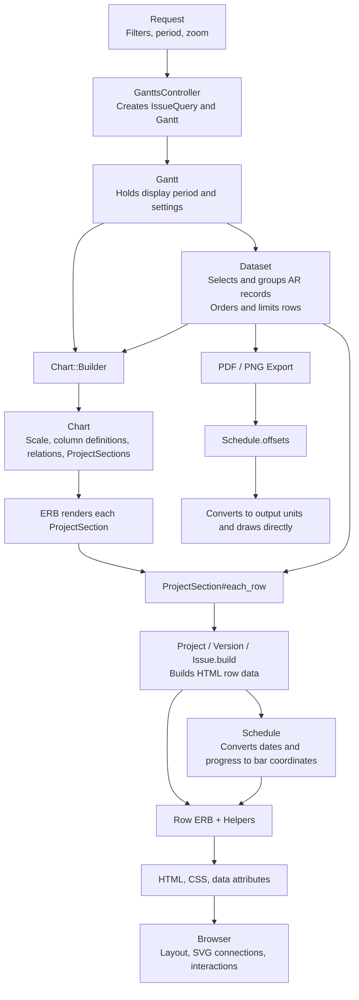

# Gantt chart data flow

[日本語](GANTT_DATA_FLOW.ja.md)

This document follows the current implementation from record selection through HTML and PDF/PNG rendering.

The basic flow is “select records → determine display order → build HTML row data → render.” These stages do not all finish before rendering starts: row construction and model access also happen while the view is being rendered.



## 1. The controller prepares the query and display settings

[GanttsController#show](../app/controllers/gantts_controller.rb) prepares two objects:

| Object | Holds |
|---|---|
| `IssueQuery` | Filters, selected columns, and display options such as relation lines |
| `Gantt` | Query, project scope, display start/end dates, zoom, and row limit |

Initializing [Gantt](../lib/redmine/gantt.rb) does not build the Chart or Dataset. Each is created on the first call to `gantt.chart` or `gantt.dataset`, and its instance is retained.

## 2. Dataset selects and groups records

The selection dependencies in [Dataset](../lib/redmine/gantt/dataset.rb) are:

```text
IssueQuery
  └─ issues: fetch matching issues
       ├─ projects: fetch their projects and visible ancestors
       ├─ project_issues: group issues by project
       │    ├─ project_versions: fetch the versions used by these issues
       │    └─ version_issues: select issues belonging to a given version
       └─ relations: fetch relations between the selected issues
```

These are ActiveRecord Project, Version, and Issue objects, not HTML Row objects.

Dataset caches its selected records and grouped results. This does not eliminate all subsequent database access: model associations and aggregate calculations used later can also query the database.

## 3. Dataset determines display order and row limits

In addition to record selection, Dataset provides these traversal methods:

| Method | Yields |
|---|---|
| `each_project` | Project, hierarchy depth, and the number of rows allowed in its section |
| `project_rows` | Each record in a project, its depth, row key, and parent row key |
| `each_row` | Rows obtained by combining the two methods above and applying the row limit |

`project_rows` uses the following order. Child projects have separate sections.

```text
Project
  Issues without a version (in parent/child order)
  Version
    Issues belonging to that version (in parent/child order)
```

At this stage, a “row” is four yielded values, not a Row object:

```ruby
record, depth, row_key, parent_row_key
```

Limits apply at two levels. `issues` limits the number of fetched issues; `each_project` also limits the displayed row count, including project and version rows.

`issues` is the starting point for record selection. `each_project` and `each_row` are the entry points for assembling the display. `projects` retrieves the relevant project set; it does not perform the traversal that applies the display row limit.

## 4. Chart assembles chart-wide information

Calling `gantt.chart` from the HTML view invokes [Chart::Builder](../lib/redmine/gantt/chart.rb).

It builds:

- Month, week, and day scale segments
- Selected columns and display options
- Timeline width and today's position
- Relation data connecting displayed rows
- `ProjectSection` objects in display order

It does not build all HTML Row objects at this point. A [ProjectSection](../lib/redmine/gantt/project_section.rb) retains a reference to Gantt, its project, depth, and allowed row count.

Building relations separately traverses `Dataset#each_row` to collect the displayed issue row keys. Dataset traversal therefore happens more than once, rather than only during rendering.

## 5. Rendering a section builds its Row objects

[_project_section.html.erb](../app/views/gantts/chart/_project_section.html.erb) calls `section.each_row`:

```text
ProjectSection#each_row
  → Dataset#project_rows
  → Take up to the section's allowed row count
  → Call .build for the record type
      ├─ Gantt::Project.build
      ├─ Gantt::Version.build
      └─ Gantt::Issue.build
  → Yield the constructed Row to the view
```

Each `.build` derives display values from an AR record:

```text
AR record + display hierarchy + Gantt period
  ↓
Row key, subject, expandability, state flags
Reference to the original AR record
Schedule
```

The row implementations are [Project](../lib/redmine/gantt/project.rb), [Version](../lib/redmine/gantt/version.rb), and [Issue](../lib/redmine/gantt/issue.rb). [Row](../lib/redmine/gantt/row.rb) holds their common attributes.

[Schedule](../lib/redmine/gantt/schedule.rb) receives dates, completion percentage, a label, and other options. It computes values such as the visible bar boundaries and the end of the completed portion.

## 6. Row views and helpers produce HTML

The Row type selects the [_project](../app/views/gantts/chart/_project.html.erb), [_version](../app/views/gantts/chart/_version.html.erb), or [_issue](../app/views/gantts/chart/_issue.html.erb) partial.

Rendering uses two sources of data:

| Rendered content | Main input |
|---|---|
| Row hierarchy, state, and bars | Row and Schedule |
| Issue links, additional columns, and tooltips | The original AR record retained by the Row |

For example, additional columns are generated during row rendering:

```text
chart.selected_columns + row.issue
  → gantt_column_value_tag
  → column_content
  → HTML
```

The Row therefore does not contain a fully converted representation of every piece of displayed content.

[ChartHelper](../app/helpers/gantts/chart_helper.rb) generates CSS variables and data attributes. In the browser, [CSS](../app/assets/stylesheets/gantt.css) lays out the chart, and [Stimulus](../app/javascript/controllers/gantt/chart_controller.js) uses DOM positions to draw relation and progress lines.

## PDF/PNG follow a separate rendering path

[Export](../lib/redmine/gantt/exports/base.rb) does not go through Chart, ProjectSection, or the HTML Row objects:

```text
Gantt
  → Export
  → Dataset#each_row
  → Read subjects, dates, and progress from AR records
  → Calculate coordinates with Schedule.offsets
  → Convert to PDF/image units and draw
```

The main shared parts are Dataset's record selection and display order, and Schedule's coordinate calculations. Extracting each row's label and schedule happens both in the HTML `.build` methods and in the export code.
