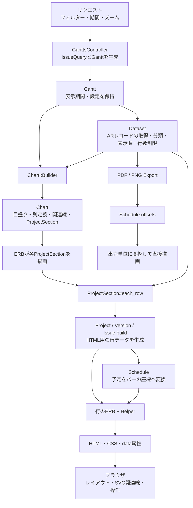

# ガントチャートのデータフロー

[English](GANTT_DATA_FLOW.en.md)

現在の実装を、対象レコードの取得からHTML・PDF／PNGの描画まで整理します。

基本的な流れは「対象レコードの取得 → 表示順の決定 → HTML用の行データ生成 → 描画」です。ただし、各段階をすべて先に完了する構造ではなく、Viewの描画中にも行データの生成やモデルへのアクセスが発生します。



## 1. Controllerが検索条件と表示設定を用意する

[GanttsController#show](../app/controllers/gantts_controller.rb)で、次の2つを用意します。

| オブジェクト | 保持するもの |
|---|---|
| `IssueQuery` | フィルター、選択列、関連線などの表示オプション |
| `Gantt` | Query、対象プロジェクト、表示開始日・終了日、ズーム、行数制限 |

[Gantt](../lib/redmine/gantt.rb)の初期化時点ではChartやDatasetを構築しません。`gantt.chart`、`gantt.dataset`が初めて呼ばれたときに生成し、そのインスタンスを保持します。

## 2. Datasetが対象レコードを取得・分類する

[Dataset](../lib/redmine/gantt/dataset.rb)の取得関係は次のようになっています。

```text
IssueQuery
  └─ issues：検索条件に合うチケットを取得
       ├─ projects：所属プロジェクトと表示可能な祖先を取得
       ├─ project_issues：チケットをプロジェクト別に分類
       │    ├─ project_versions：使われているバージョンを取得
       │    └─ version_issues：そのバージョンのチケットを抽出
       └─ relations：取得したチケット同士の関連を取得
```

ここで扱うのはActiveRecordのProject／Version／Issueです。HTML用のRowではありません。

取得結果や分類結果はDataset内でキャッシュされます。ただし、これで以降のDBアクセスがすべて済むわけではありません。後段で呼ぶモデルの関連や集計処理からもDBアクセスが発生します。

## 3. Datasetが表示順と行数制限を決める

取得とは別に、次の走査メソッドがあります。

| メソッド | 出力 |
|---|---|
| `each_project` | プロジェクト、階層の深さ、そのセクションに許可する行数 |
| `project_rows` | プロジェクト内の各レコード、深さ、行キー、親行キー |
| `each_row` | 上の2つを組み合わせ、行数制限を適用した各行 |

`project_rows`の順序は次のとおりです。子プロジェクトは別のセクションになります。

```text
プロジェクト
  バージョン未設定のチケット（親子順）
  バージョン
    そのバージョンのチケット（親子順）
```

この段階の「行」はRowオブジェクトではなく、次の4値です。

```ruby
record, depth, row_key, parent_row_key
```

行数制限は2段階あります。`issues`の取得件数を制限し、さらに`each_project`でプロジェクト行・バージョン行も含めた表示行数を制限します。

データ取得の起点は`issues`、表示を組み立てる入口は`each_project`／`each_row`です。`projects`は対象プロジェクトの集合を取得するメソッドで、表示行数制限を適用する走査とは異なります。

## 4. Chartがチャート全体の情報を組み立てる

HTMLのViewから`gantt.chart`を呼ぶと、[Chart::Builder](../lib/redmine/gantt/chart.rb)が動きます。

作るものは次のとおりです。

- 月・週・日の目盛り
- 選択列と表示オプション
- タイムライン幅、今日の位置
- 表示対象行同士の関連線データ
- 表示順に並んだ`ProjectSection`

ここではHTML用の全Rowを生成しません。[ProjectSection](../lib/redmine/gantt/project_section.rb)はGanttへの参照と、プロジェクト・深さ・許可行数を保持します。

関連線の生成では、別途`Dataset#each_row`を走査して表示対象のチケット行キーを集めます。つまり、Datasetの走査は描画時の一度だけではありません。

## 5. Viewがセクションを描画するときにRowを生成する

[_project_section.html.erb](../app/views/gantts/chart/_project_section.html.erb)が`section.each_row`を呼びます。

```text
ProjectSection#each_row
  → Dataset#project_rows
  → セクションの許可行数まで取得
  → レコードの種類に応じて .build
      ├─ Gantt::Project.build
      ├─ Gantt::Version.build
      └─ Gantt::Issue.build
  → 生成したRowをViewに渡す
```

各`.build`で、ARレコードから表示用の値を作ります。

```text
ARレコード + 表示上の階層 + Ganttの期間
  ↓
行キー・件名・折りたたみ可否・状態フラグ
元のARレコードへの参照
Schedule
```

行の実装は[Project](../lib/redmine/gantt/project.rb)、[Version](../lib/redmine/gantt/version.rb)、[Issue](../lib/redmine/gantt/issue.rb)です。共通属性は[Row](../lib/redmine/gantt/row.rb)が保持します。

[Schedule](../lib/redmine/gantt/schedule.rb)には日付・進捗率・ラベルなどを渡し、表示期間内のバー位置や進捗部分の終端などを計算させます。

## 6. 行のViewとHelperがHTMLを生成する

生成したRowの種類に応じて、[_project](../app/views/gantts/chart/_project.html.erb)、[_version](../app/views/gantts/chart/_version.html.erb)、[_issue](../app/views/gantts/chart/_issue.html.erb)を描画します。

ここでは入力が2系統あります。

| 描画するもの | 主な入力 |
|---|---|
| 行の階層・状態・バー | RowとSchedule |
| チケットリンク・追加列・ツールチップ | Rowが保持する元のARレコード |

例えば追加列は、行の描画中に次の経路で生成します。

```text
chart.selected_columns + row.issue
  → gantt_column_value_tag
  → column_content
  → HTML
```

Rowにすべての表示内容を変換済み、という構造ではありません。

[ChartHelper](../app/helpers/gantts/chart_helper.rb)がCSS変数やdata属性を生成し、ブラウザ側では[CSS](../app/assets/stylesheets/gantt.css)が配置し、[Stimulus](../app/javascript/controllers/gantt/chart_controller.js)がDOMの位置を使って関連線・進捗線を描きます。

## PDF／PNGは途中から別経路

[Export](../lib/redmine/gantt/exports/base.rb)はChart・ProjectSection・HTML用Rowを経由しません。

```text
Gantt
  → Export
  → Dataset#each_row
  → ARレコードから件名・日付・進捗を取得
  → Schedule.offsetsで座標計算
  → PDF／画像の単位へ変換して描画
```

出力間で共有している中心は、Datasetの対象選択・表示順と、Scheduleの座標計算です。行ごとのラベルや予定の取り出しは、HTML用の`.build`とExport側の両方に存在します。
